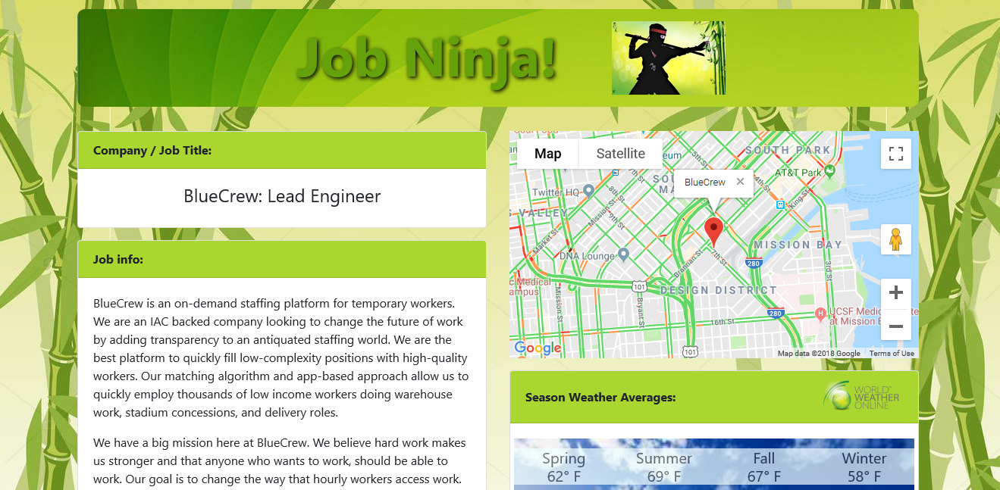
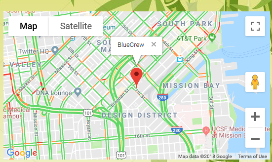
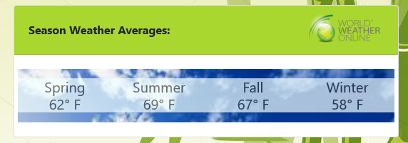
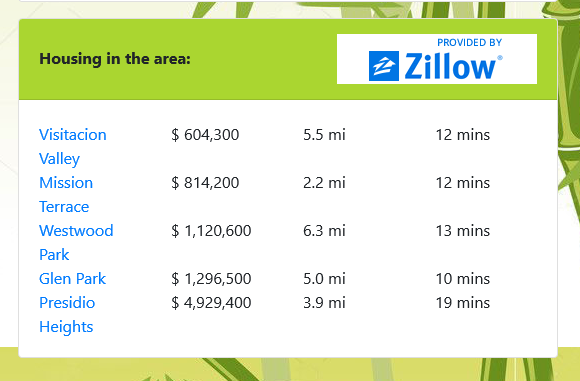
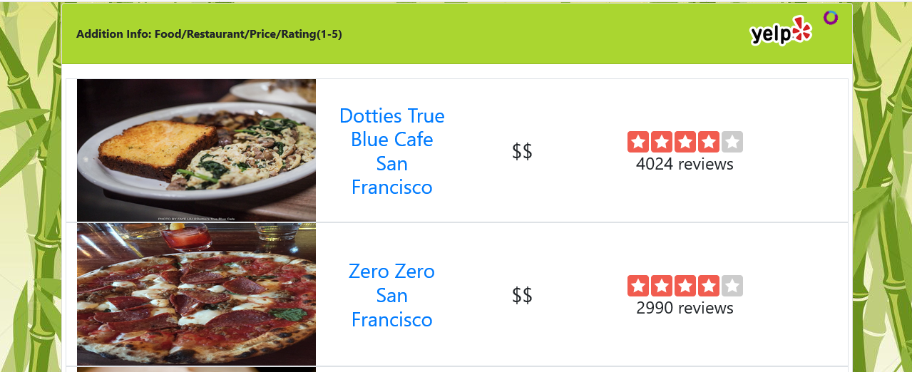
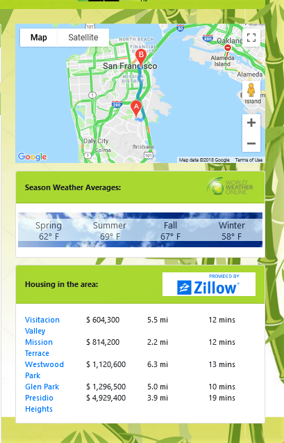

<h1>Job Ninja!<h1> 

<h2>The comprehensive job and area search site for web developers.<h2>

<h3>Motivation and Description:<h3>

Asked as a group to create a website utilizing API calls, the authors each had ideas of sites they would like to build. Unable to immediatley come to a consensus, the ideas were combined to make a comprehensive national job search site for Web Developers with many additional features. The site first lists jobs of interest but also gives users details about area traffic, commute times, average weather, available housing with average cost and popular area restaurants for selected jobs.

<h3>Instructions for use:<h3>

In our main page, simply enter the job title and the state you would like to search in the provided search fields and click the search button(img 1). A list of available jobs meeting those criteria will populate (img 2). After selecting a job you are interested in from the search results, click that job to open a new tab. The new tab will display the details of that job to the left and helpful related information on the right (img 3). The additional information includes: a map of the company location(img 4), the average local weather for the current season(img 5),local available housing for purchase (img 6) and the most popular local restaurants (img 7). In addition, you may view local traffic and commute times to the job from the available houses by clicking on the distance in miles located to the right (img 8). 

<h3>Screenshots:<h3>

 
Img 1 - Opening Page 
 

 
Img 2 - Initial Search 
 

 
Img 3 - Job Detail Tab 
 

 
Img 4 - Company Location Map  
 

 
Img 5 - Average Local Weather 
 

 
Img 6 - Available Housing For Sale 
 

 
Img 7 - Most Popular Area Restaurants 
 

 
Img 8 - Commute Distance and Time 

<h3>Technologies Used:<h3>

<h4>Frameworks and languages used in the construction of this site:<h4>
 HTML, CSS & JavaScript.

<h4>We have also utilized the following libraries:<h4>

1. Jquery - https://jquery.com/ 
https://code.jquery.com/jquery-3.3.1.min.js
2. Bootstrap - https://getbootstrap.com/ 
https://stackpath.bootstrapcdn.com/bootstrap/4.1.3/css/bootstrap.min.ccs
3. Animate.Css - https://daneden.github.io/animate.css/ 
https://cdnjs.cloudflare.com/ajax/libs/animate.css/3.5.2/animate.min.css
4. Font Awesome -https://fontawesome.com/free 
https://use.fontawesome.com/releases/v5.2.0/css/all.css

<h3>API References:<h3>
<h4>Below are the links to the APis used<h4>

1. Github Jobs - https://jobs.github.com/api
2. Zillow - https://www.zillow.com/howto/api/GetSearchResults.htm
3. World Weather Online - https://developer.worldweatheronline.com/api/
4. Google Maps - https://developers.google.com/maps/documentation/
5. Google Places - https://developers.google.com/places/web-service/intro
6. Yelp - https://www.yelp.com/developers

<h3>Credits:<h3>

1. Vincent Ngyuen: Javascript, Api Calls on Details Tab 
    https://vnguye51.github.io/
2. Amico Kaur: Javascript, Api Calls on main page 
    https://amicokaur.github.io/
3. Isaac Romero: Css, Bootstrap, fonts, formatting & styling 
    http://iromero385.github.io/
4. Elena Belgum: Readme, images, css, Bootstrap, formatting & styling 
    https://github.com/Counttalkula666
5. Special thanks to: Alex Pham, Job Ninja! 
    https://www.youtube.com/channel/UCtm7E8o5lbdj0SGab8fWXXw

